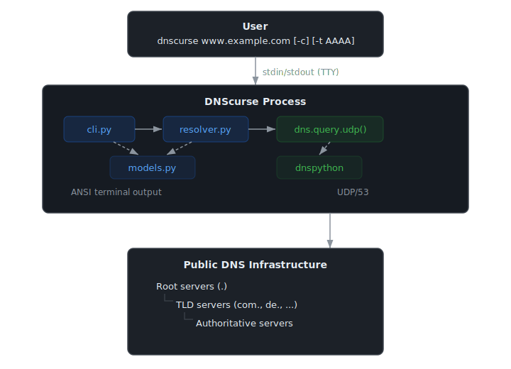

# DNScurse — Architecture

**Audience:** Software architects and senior engineers evaluating or extending the codebase.

---

## 1. Purpose and Scope

DNScurse is a DNS iterative resolver that makes every resolution step observable. Unlike `dig +trace`, which produces raw packet dumps, DNScurse explains each step in human terms and renders the delegation chain as a colored hierarchy.

The tool has a single responsibility: perform iterative DNS resolution from root servers and surface each step with enough context for a human to understand what happened and why.

---

## 2. System Context



There are no background threads, no persistent processes, no sockets held open between steps. Each DNS query is a discrete UDP send/receive within a single synchronous call stack.

---

## 3. Module Decomposition

```
dnscurse/
├── __main__.py       Entry point for python -m dnscurse
├── cli.py            Argument parsing + all rendering (2 output modes)
├── resolver.py       Iterative resolution algorithm (RFC 1034 §5.3.3)
└── models.py         RecursionStep dataclass + dns.message.Message helpers
```

### Dependency graph

```
cli.py
  ├── models.py   (RecursionStep, get_delegated_zone, format_rrset, …)
  └── resolver.py (resolve)

resolver.py
  ├── models.py   (RecursionStep, is_referral, get_cname_target, …)
  └── dnspython   (dns.query, dns.message, dns.flags, dns.exception)

models.py
  └── dnspython   (dns.message.Message, dns.name, dns.rdatatype, …)
```

`cli.py` is the only module that knows about terminal output. `resolver.py` knows nothing about display. `models.py` knows nothing about either. This layering is intentional and enforced by the dependency direction — inverting it (e.g., putting rendering logic in `resolver.py`) is a structural violation.

---

## 4. The Resolution Algorithm

The core algorithm in `resolver.py` directly implements **[RFC 1034 Section 5.3.3](https://www.rfc-editor.org/rfc/rfc1034#section-5.3.3)** ("Standard name resolution algorithm"). Every branch in the main loop maps to a numbered step in that RFC section.

### Control flow

```
resolve(name, rdtype)
│
├── Initialize: current_name=name, server=root[0], sibling_servers=[]
│
└── LOOP (max MAX_STEPS=30 iterations)
    │
    ├── send_query(current_name, rdtype, server_ip)  [UDP, RD=0]
    │   │
    │   ├── OSError / DNSException
    │   │     record step.error
    │   │     try sibling_servers → continue
    │   │     or break
    │   │
    │   └── response received
    │         step.truncated = TC flag
    │
    ├── RCODE != NOERROR?
    │   ├── SERVFAIL / REFUSED → try sibling_servers → continue / break
    │   └── NXDOMAIN / other  → break  (authoritative, no retry)
    │
    ├── response.answer non-empty?
    │   ├── CNAME (and not querying for CNAME type)?
    │   │     cname_follows++
    │   │     if > MAX_CNAME_FOLLOWS → break
    │   │     current_name = cname_target
    │   │     server = root[0]          ← restart from root (RFC 1034 §3.6.2)
    │   │     continue
    │   └── other answer → break  (done)
    │
    ├── is_referral(response)?
    │   ├── glue IPs present?
    │   │     sibling_servers = [(name, ip) for each glue]
    │   │     server = sibling_servers.pop(0)
    │   │     continue
    │   └── no glue?
    │         ns_names = get_referral_ns_names(response)
    │         ns_ip = resolve(ns_names[0], A)  ← recursive sub-resolution
    │         server = ns_ip
    │         continue
    │
    └── NODATA (NOERROR, empty answer, no NS referral) → break
```

### Key design decisions in the algorithm

**RD=0 (Recursion Desired off).** Every query clears the RD flag before sending. This forces each nameserver to either answer authoritatively or return a referral — it cannot silently recurse on our behalf. Without this, the whole chain collapses to one step and we learn nothing.

**The same QNAME is sent to every server.** Root servers, TLD servers, and authoritative servers all receive `dalek.home.codevoid.de A`. Each server responds based on its zone of authority. This is correct per [RFC 1034 §3.3](https://www.rfc-editor.org/rfc/rfc1034#section-3.3) — the full name is required at every hop so the server can identify which zone covers it.

**CNAME restarts from root.** When a CNAME is encountered, `current_name` is updated to the target and `server` is reset to the root. This is mandated by [RFC 1034 §3.6.2](https://www.rfc-editor.org/rfc/rfc1034#section-3.6.2): "the resolver must restart the query at the canonical name." Continuing from the current nameserver would be incorrect because the CNAME target may be in a completely different zone hierarchy.

**Recursive sub-resolution for glueless referrals.** When a referral has NS names but no glue A records, the NS name itself must be resolved before the main resolution can proceed. This is handled by a recursive call to `resolve()`. The sub-resolution result is thrown away after extracting the IP — only the main resolution's steps are returned to the caller. This keeps the output clean while correctly handling cross-zone NS names.

**`sibling_servers` as a retry queue.** Each referral may name multiple nameservers. The first is used immediately; the rest are queued as `sibling_servers`. If the first returns SERVFAIL or REFUSED, or if a network error occurs, the next sibling is tried. NXDOMAIN does not trigger sibling retry because it is an authoritative negative response — all siblings for that zone would say the same thing.

---

## 5. The Data Model

### `RecursionStep`

```python
@dataclass
class RecursionStep:
    step_number: int
    description: str
    server_ip:   str
    server_name: str
    query_name:  str
    query_type:  str
    response:    dns.message.Message | None = None
    error:       str | None                = None
    rtt_ms:      float | None              = None
    truncated:   bool                      = False
```

`RecursionStep` is a **value object**: immutable after construction except for the optional fields (`response`, `error`, `rtt_ms`, `truncated`) which are filled in after the network call completes. It is the only custom type the application defines — everything else uses dnspython's types directly.

**Why not a class hierarchy?** A hierarchy (`ReferralStep`, `AnswerStep`, `ErrorStep`) would scatter rendering logic across subclasses and make the response type discriminated at construction time, before the response is even received. Instead, response *interpretation* is deferred to helper functions in `models.py` (`is_referral`, `get_cname_target`) and rendering code in `cli.py`. This keeps `RecursionStep` as a plain record.

**`dns.message.Message` is used directly.** There is no wrapper type around the DNS packet. dnspython's `Message` class already provides correct parsing of all record types, wire-format encoding, and case-insensitive name comparison. Wrapping it would add indirection without adding correctness. The tradeoff is that callers must know the dnspython API, which is a well-documented, stable library.

### Helper functions in `models.py`

| Function | Purpose |
|---|---|
| `is_referral(msg)` | True if the packet has NS in authority and no answers — the canonical referral signature |
| `get_referral_ns_ips(msg)` | Extracts glue A/AAAA records paired with NS targets from the additional section |
| `get_referral_ns_names(msg)` | Extracts NS target names from the authority section |
| `get_cname_target(msg, name)` | Returns CNAME target if the answer section contains a CNAME for `name` |
| `get_delegated_zone(step)` | Returns the zone that a step operates within — referral's NS owner or the query name for answers |
| `format_rrset(rrset)` | dig-style `NAME TTL TYPE RDATA` formatting |

These are **pure functions** — they take a `Message` or `RecursionStep` and return a value without side effects. This makes them trivially testable with constructed `Message` objects.

---

## 6. The Boundary with dnspython

DNScurse delegates a specific, bounded set of concerns to dnspython:

| Concern | Handled by |
|---|---|
| UDP transport | `dns.query.udp()` |
| Wire format encode/decode | `dns.message.make_query()`, `dns.message.Message` |
| Name parsing and comparison | `dns.name.from_text()`, `dns.name.Name.__eq__` |
| Record type parsing (A, NS, CNAME, MX, …) | `dns.rdatatype`, `dns.rdata` |
| Timeout and network exceptions | `dns.exception.DNSException`, `OSError` |

Everything else — the iteration logic, referral detection, CNAME handling, output rendering — is implemented in this codebase.

**`send_query()` is the seam.** The resolution algorithm calls `send_query()`, which is a thin wrapper around `dns.query.udp()`. In tests, `send_query` is monkeypatched with a `fake_send` function that returns crafted `Message` objects. This means the entire resolution logic — referral chains, CNAME follows, sibling failover — can be tested without network access by injecting responses at this one boundary.

---

## 7. The CLI and Rendering Layer

`cli.py` contains two output modes selected by the `-c` / `--compact` flag:

### Block mode (default)

One block per resolution step, showing server, RCODE, result, and RTT. The domain name header is colorized to highlight the zone under investigation at each step.

```
www.example.com A          ← query header, colorized by hop depth
  server  a.root-servers.net (198.41.0.4)
  rcode   NOERROR
  result  referral → l.gtld-servers.net.
  time    107.3ms
```

### Compact Tree mode (`-c`)

The full delegation chain rendered as a tree with the query name as the root:

```
www.example.com A
  . (a.root-servers.net)
    └── com. (l.gtld-servers.net.)
        └── example.com. (hera.ns.cloudflare.com.)
            └── www A 104.18.26.120
```

### The coloring model

Color is the most semantically rich part of the rendering. The principle:

> Each server hop gets one color. All labels introduced by that hop share that color. The same label has the same color in both output modes.

For `www.example.com` resolved in 3 hops (root → com. → example.com.):

```
Hop 0 (root):         introduces "com"      → green
Hop 1 (com. NS):      introduces "example"  → yellow
Hop 2 (answer):       introduces "www"      → magenta
```

The header `www.example.com A` renders `www` in magenta, `example` in yellow, `com` in green — so a reader can visually trace which server resolved which part of the name.

For a deep subdomain like `dalek.home.codevoid.de` where `codevoid.de.` answers authoritatively for both `home` and `dalek` (i.e., there is no `home.codevoid.de.` delegation), both labels share the same hop color. This is distinct from individual-label coloring — the grouping reflects actual DNS authority boundaries, not syntactic label position.

**Color computation** in `_format_tree()`:
1. Build `nodes` list: `[(".", root_server), (zone₁, server₁), (zone₂, server₂), …]`
2. For each node at depth D, compute `new_label_count = len(zone_D.labels) - len(zone_{D-1}.labels)`
3. Assign `_level_color(D)` to those label positions in the query name string
4. Any remaining labels (the host part within the final authoritative zone) get `_level_color(leaf_depth)`

**Color computation** in `_format_step_block()`:
- `focus_color = _level_color(step_idx + 1)` — the `+1` offset aligns with tree depth, where depth 0 is the root and the first zone label appears at depth 1
- `_colorize_domain(domain, zone, parent_zone, focus_color)` splits the domain into prefix (dim), focus (colored), and already-resolved suffix (dim)

**Auto-detection:** `color = sys.stdout.isatty()` — color is suppressed when output is piped, preserving machine-readability.

---

## 8. Data Flow

```
User types: dnscurse www.example.com

main()
  │
  ├── argparse → name="www.example.com", rdtype=A, compact=False
  ├── dns.name.from_text(name)  ← input validation, raises on malformed input
  │
  └── resolve("www.example.com", A)
        │
        ├── Step 1: send_query("www.example.com", A, 198.41.0.4)
        │     Response: referral → com. (glue: 192.5.6.30, …)
        │     RecursionStep(step_number=1, server="a.root-servers.net", …)
        │
        ├── Step 2: send_query("www.example.com", A, 192.5.6.30)
        │     Response: referral → example.com. (glue: 199.43.135.53)
        │     RecursionStep(step_number=2, server="l.gtld-servers.net.", …)
        │
        └── Step 3: send_query("www.example.com", A, 199.43.135.53)
              Response: answer A 104.18.26.120
              RecursionStep(step_number=3, server="hera.ns.cloudflare.com.", …)
              → break, return [step1, step2, step3]

  back in main():
  prev_zone = None
  for step_idx, step in enumerate(steps):
      _format_step_block(step, color, prev_zone, step_idx) → print
      prev_zone = get_delegated_zone(step)

  print Answer summary
  print "{n} steps, {total_ms}ms total"
```

---

## 9. Testing Strategy

Tests live in `tests/` and are split into unit and integration tiers:

### Unit tests (no network)

`send_query` is monkeypatched at the module level via `unittest.mock.patch`. Each test provides a `fake_send(name, rdtype, server_ip, timeout)` function that returns crafted `dns.message.Message` objects. The helper `_msg(answer=…, authority=…, additional=…)` in `test_resolver.py` builds these objects from simple tuples.

This architecture means the entire resolution algorithm is covered without a network connection, with deterministic timing and crafted edge-case responses. Tests read as executable documentation — each test method has an `EXPLANATION:` block in its docstring describing the DNS concept being exercised.

### Integration tests (`@pytest.mark.network`)

A small set of tests resolve real domains (`example.com`, a non-existent domain) against live root servers. These are excluded from CI by default (`-m "not network"`) and exist to validate end-to-end correctness against the real DNS hierarchy.

### Tested behaviors

- 3-step referral chain (root → TLD → authoritative)
- CNAME detection and restart-from-root
- CNAME loop termination at `MAX_CNAME_FOLLOWS=8`
- SERVFAIL/REFUSED sibling failover
- NXDOMAIN not retried (authoritative negative)
- Network error sibling failover
- Glueless referral triggering sub-resolution
- `MAX_STEPS=30` circular referral termination
- Referral/CNAME detection in `models.py` helper functions
- `get_delegated_zone()` for referral, answer, NXDOMAIN, and error cases

---

## 10. Safety Limits

Two constants prevent unbounded resolution:

| Constant | Value | Rationale |
|---|---|---|
| `MAX_STEPS` | 30 | BIND uses ~30 as its referral hop limit. Prevents infinite loops from circular referral configurations. |
| `MAX_CNAME_FOLLOWS` | 8 | Prevents CNAME chain loops (A → B → A). No RFC specifies a limit; BIND uses 16. 8 is conservative and sufficient for all legitimate chains. |

These are module-level constants, exported and tested directly.

---

## 11. Known Limitations

These are deliberate scope decisions for the current version, not bugs:

**No cache.** Every invocation resolves from root. This is intentional — caching would hide the delegation chain that DNScurse exists to expose.

**UDP only, no TCP fallback.** If a response has the TC (truncation) flag set, the truncated response is recorded with `step.truncated = True` and a warning in `explain()`, but no TCP retry is attempted. Full resolvers retry over TCP; this tool records the truncation and continues with whatever data was received.

**No DNSSEC validation.** DNSSEC signatures are not checked. DNScurse is a diagnostic tool for delegation chain visibility, not a validating resolver.

**No DNAME support.** DNAME records ([RFC 2672](https://www.rfc-editor.org/rfc/rfc2672), subtree aliasing) are not handled. A DNAME will cause resolution to stop at the DNAME response without following it.

**Hardcoded root hints.** Root server IPs are hardcoded at `resolver.py:ROOT_SERVERS`. IANA root server addresses change rarely but are not fetched dynamically. The list matches the IANA root hints file as of 2026.

**Timeout is per-query, not total.** `--timeout=5` means each individual UDP query may wait up to 5 seconds. A resolution with many steps and slow servers can take much longer than the timeout value suggests.

---

## 12. Extension Points

The architecture supports the following extensions without restructuring:

**Adding a new output mode** — add a rendering function in `cli.py` following the `_format_tree` / `_format_step_block` pattern, and add a flag in `main()`. The `steps: list[RecursionStep]` list contains all the data needed for any rendering.

**Caching** — add a cache dict keyed on `(name, rdtype)` at the top of `resolve()`. The `send_query` seam makes it easy to short-circuit before sending a query.

**TCP fallback for truncated responses** — in `resolve()`, after detecting `step.truncated`, call `dns.query.tcp()` instead of `dns.query.udp()` and replace the step's response.

**Alternative transport** — `send_query()` is the sole network boundary. Replacing it with a DoH or DoT implementation requires no changes elsewhere in the codebase.

**Programmatic use** — `resolve(name, rdtype)` returns `list[RecursionStep]` and has no side effects. It can be imported and used as a library without the CLI. The only external dependency is dnspython.
